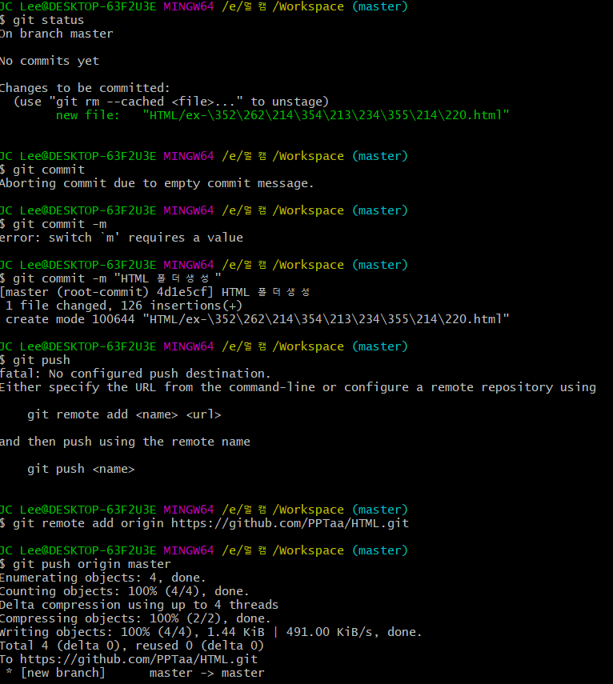
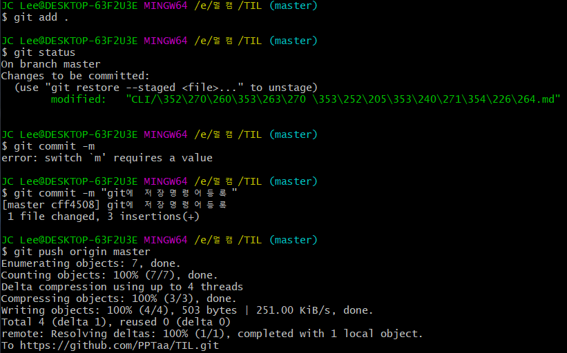

# 기본 명령어

> CLI (command line interface)명령어를 배워 봅시다.

| 명령어   | 내용                                 |
| -------- | ------------------------------------ |
| pwd      | 현재 작업 위치 보기                  |
| cd       | change directory 작업위치 변겨인     |
| ls       | 현재 폴더 내부의 폴더, 파일들을 출력 |
| git init |                                      |
| ls -a    | 숨김파일들 까지 모두 출력            |
| .        | 현재폴더                             |
| ..       | 상위폴더                             |
| .폴더명  | 숨김폴더                             |
|          |                                      |

## 폴더 git에 연결시키기

1. 폴더 탐색기에서 우클릭 git bash실행
2. git init 으로 .git 생성
3. github에서 새로운 repository 생성
4. repository에서 remote add origin https://~~ 복사후 git bash에서 실행
5. git에 저장하기

## git 에 저장

1. git add .
2. git status
3. git commit -m "메시지 작성"
4. git push origin master

