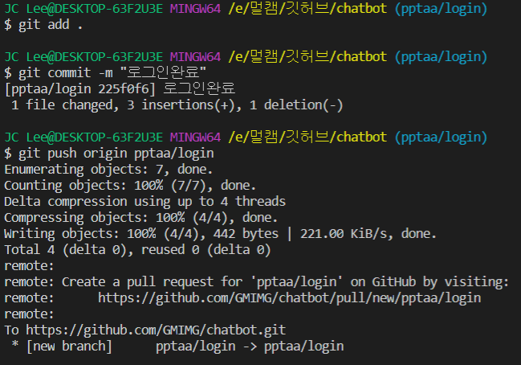

# Branch

### github 브랜치에 대한 이해

다른사람들과 협업하기위해 사용하는 것

main 인 master를 건드리지 않고 자신의 것에서 작업하는것

### github 브랜치 단축어

1. 브랜치 생성 : `git branch {브랜치이름}`

   

2. 브랜치 확인 : `git branch`

   

3. 브랜치 이동 : `git checkout {브랜치이름}`

   

4. 브랜치 삭제 : `git branch -d {브랜치이름}`

   

5. 브랜치 생성 + 이동 : `git checkout -b {브랜치이름}`

   

### 협업

서로 다른 브랜치를 만들고 협업을 하게 되고, 서로 푸시를 하게 되는 상황

1. 깃허브에서 새로운 pull request를 해야함 > New pull request

2. 나의 브랜치에서 마스터 브랜치로 create pull request 해야함 > Create pull request

3. github이 비교해서 충돌이 없으면 알아서 머지를 해줌

   