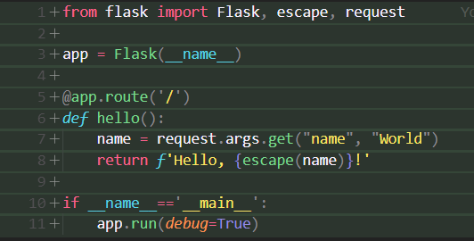
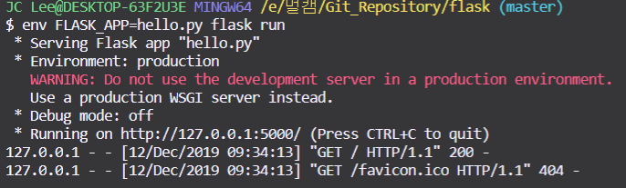
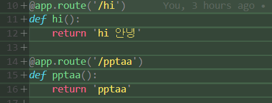
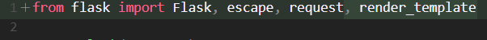
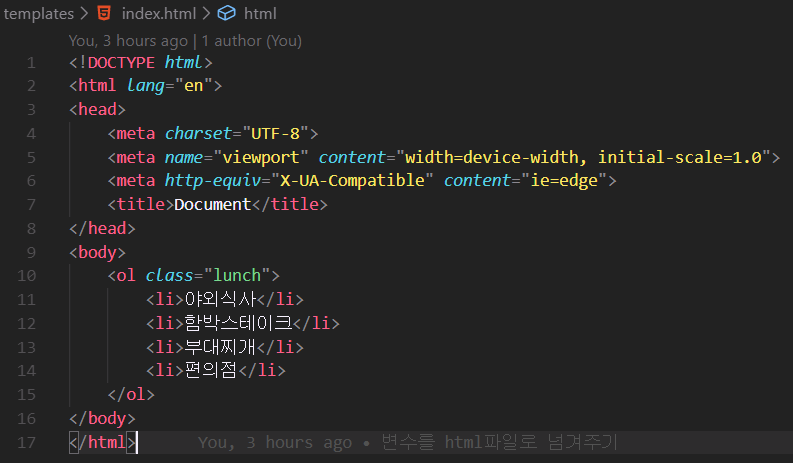
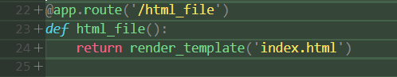
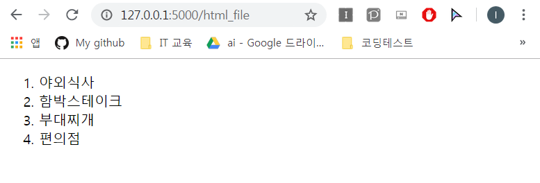

# flask 활용 웹 만들기

> 2019-12-12(목)

### flask 기본설정

구글에서 flask 검색후

https://www.palletsprojects.com/p/flask/ 에 접속하여 python.py에 복사 붙여넣기

페이지의 env FLASK_APP=hello.py flask run 를 복사 붙여넣기 하면 서버가 실행됨

http://127.0.0.1:5000/에 들어가서 확인 할 수 있음

위의 사진처럼 작성하게 되면 

http://127.0.0.1:5000/hi 에는 `hi 안녕` 이 출력되고,

http://127.0.0.1:5000/pptaa 에는 `pptaa`가 출력됨

### flask로 파이썬과  html 매핑하기

가장먼저 flask에서 render_template을 임포트해야함

index.html파일을 제작해놓아야함

이후 매핑을 할때 render_template('`HTML파일`')을 return 함

결과

### flask의 파이썬함수 적용