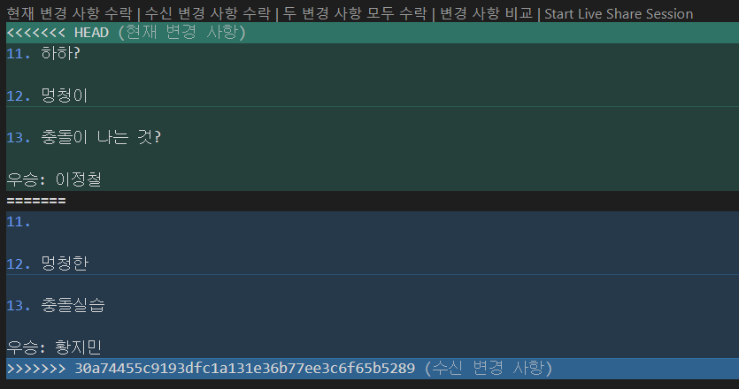
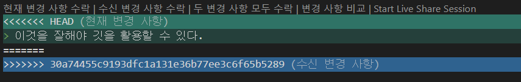
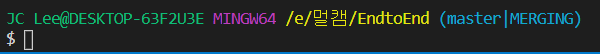
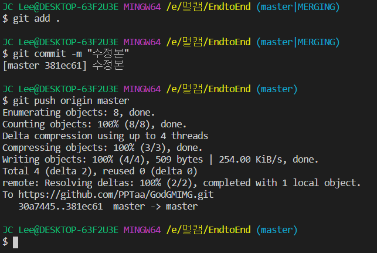
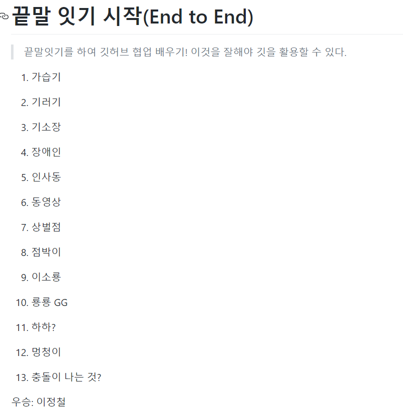

# GitHub 충돌 관리

1. A유저와 B유저가 같은 환경에서 시작
2. A유저가 A내용을 커밋후 푸시를 함
3. B유저가 B내용을 커밋후 A유저의 작업을 Pull해올때 충돌이 일어남
4. 
5. 
6. 두가지 충돌이 일어났고, 그중에 골라서 저장을 함
7. 저장을 하게되면 MERGING중으로 나오게됨
8. 
9. add, commit을 하면 merging이 되게 되고, push를 하면 깃허브에 올라가게됨
10. 
11. 결과 

