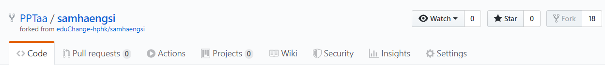

# Github를 활용한 협업, 끝말잇기

## 끝말잇기

1. github에 새repository 만들기
2. 그 repostiory에 markdown 파일 올리기 (push origin master)
3. 
4. 이 파일을 다른사람이 받을때는 clone을 만들고 pull해야함
5. 
6. 
7. 이후 이 작업들을 반복해서 활용하면됨

## fork를 활용한 삼행시 (강사님 repository에)

1. 다른사람의 open source를 활용하거나 협업하려고 할때 fork를 눌러서 나의 repository 로 가져오기
2. 
3. 이후 clone을 복사하고 내 컴퓨터에 클론 만들기
4. 
5. 
6. 받은 repository의 내용 수정 후 push
7. 
8. repository의 주인이 자신이 원하는 내용의 코드를 선택해 merge, 별로인것은 close
9. 
10. merge
11. close
12. 추가된 내용들을 insights에서 확인할 수 있음 
13. 

