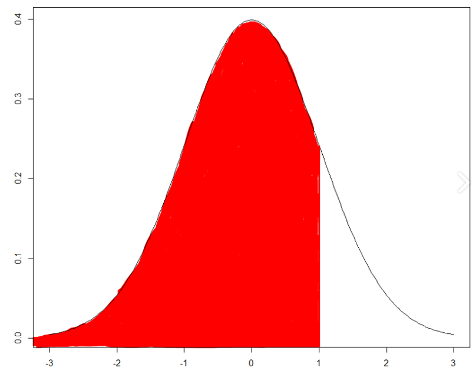
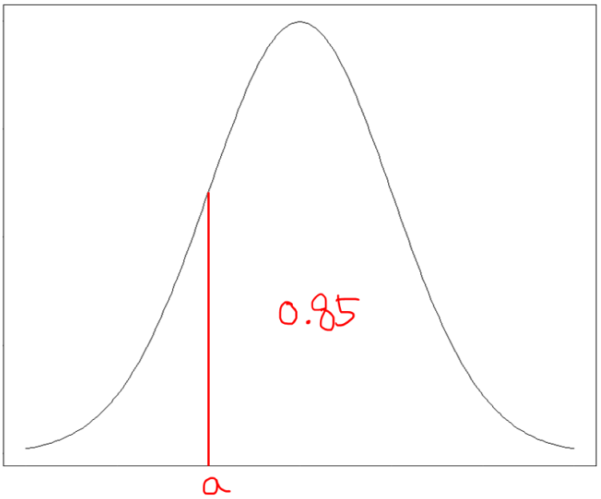

# 통계수업

## 오전시간


### 통계패키지 설치

R for windows 설치, 

R studio 설치

r = 통계기능에 특화되어있는 언어

#### R

= 와 <-의 차이점

= 는 데이터프레임을 만들 때 데이터프레임을 활용한 함수가 끝났을 때 더이상 사용하지 않음

<- 는 함수내에서 전역변수를 사용할 수 있음 데이터프레임을 활용한 함수가 끝나도 계속 변수들을 사용할 수 있음

### 연속확률분포

#### 정규분포(normal distribution) - norm

- 평균과 표준편차에 의해 모양과 위치가 결정된다.

- 첨도는 0, 평균은 0, 표준편차가 1인 분포가 표준정규분포

- 산술평균=중위수=최빈수 
- 개별치의 확률분포가 정규분포가 아니더라도 표본의 크기가 클수록 표본평균의 분포는 정규분포와 가까워진다.

##### R에서 제공하는 정규분포함수 

- rnorm (난수함수) : 정규분포함수의 변수에 해당하는 값을 임의로 생성해 주는 함수, 디폴트값은 '표준정규분포', 평균과 표준편차를 설정해서 생성할 수 있음.

````R
rnorm(5,mean=100,sd=5)
#평균이 100, 표준편차가 5인 변수 5개 생성
````

- pnrom(누적분포함수) : 

  ````R
  pnorm(1)
  #pnorm(1)일때 아래의 그래프중 색칠한 부분의 넓이
  ````

  

- qnorm(분위수함수) : 정규분포를 따르는 모집단에서 특정 **누적분포함수 값 p에 해당**하는 **분위수 q 를 알고 싶을 때 사용**하는 R 함수가 분위수 함수 qnorm()이 되겠습니다. 

  분위수 함수는 누적분포함수의 역함수이고, 반대로 누적분포함수는 분위수 함수의 역함수라고 말할 수 있습니다.

````R
qnorm(p, mean=0, sd=1, lower.tail=TRUE/FALSE)
#ex
qnorm(0.85)
````



#### 균등분포(uniform distribution) - unif

균등분포(uniform distribution)은 연속형 확률 분포 중에서 가장 간단한 형태로서, 구간 [mi=a, max=b]에서 값이 균등하게 퍼져 있는 집단, 일어날 확률이 균등한 분포를 말합니다.

#### 지수분포(exponential distribution) - exp

한 사건이 발생한 이후, 다음사건이 발생할 때 까지의 시간에 대한 확률분포

- 확률밀도함수

$$
f(t,\lambda)=e^{-\lambda t}(t\geq0)
$$

- 특징

$$
기대값 \ :\ E(t,\lambda)=1/\lambda \\
V(t,\lambda)=1/\lambda^2\\
누적분포함수\ : \ F(t,\lambda)=1-e^{-\lambda t}
$$

#### 카이제곱분포(chisq-distribution) - chisq

카이제곱 분포 (chi-squared distribution)은 k개의 서로 독립적이고 **표준정규분포를 따르는 확률변수 X 를 제곱한 값들을 합하였을 때의 분포**

이때 **k 는 자유도 (degrees of freedom) 로서 카이제곱 분포의 parameter** 가 됩니다.

표준정규분포의 분산이 그리는 분포

random 변수들이 표준정규분포를 따르는지 검사할 때 사용
$$
x^2(k-1)=\frac{\sum_{i=1}^k(x_i-\overline x)^2}{\sigma^2}=\frac{(k-1)s^2}{\sigma^2}\\
s^2=\frac{\sum_{i=1}^k(x_i-\overline x)^2}{k-1}
$$
mse(mean squared error)

#### SST(Total Sum of Squares)

개별 y의 편차제곱의 합

#### SSE(Explain Sum of Squares)

회귀식 추정 y의 편차제곱의 합

#### SSR(Residual Sum of Squares)

잔차의 제곱의 합
$$
총변동 = 설명된 변동 + 설명안된 변동\\SST=SSE+SSR\\
R^2\equiv \frac{SSE}{SST}=1-\frac{SSR}{SST}\\
\sigma^2=\frac{SSE}{N-P-1}\\
\sigma=\sqrt{\frac{SSE}{N-P-1}}
$$


SST=SSE+SSR